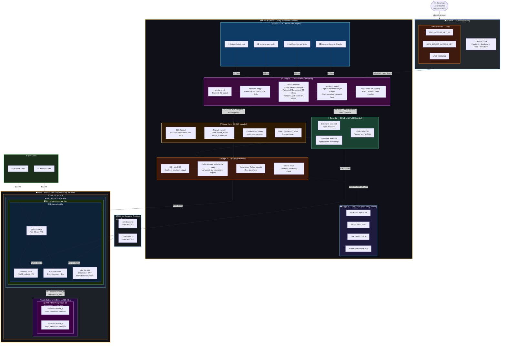
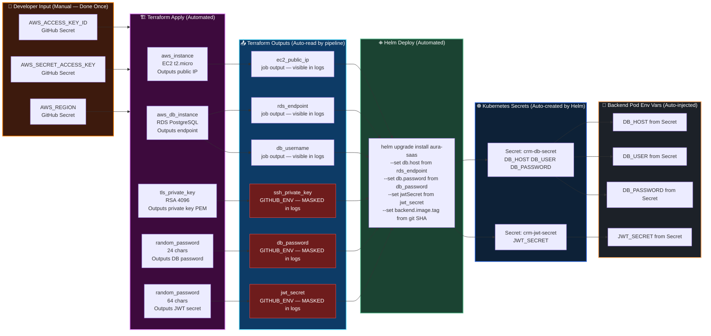
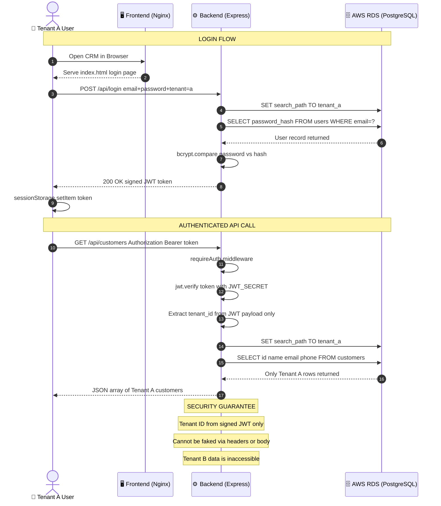
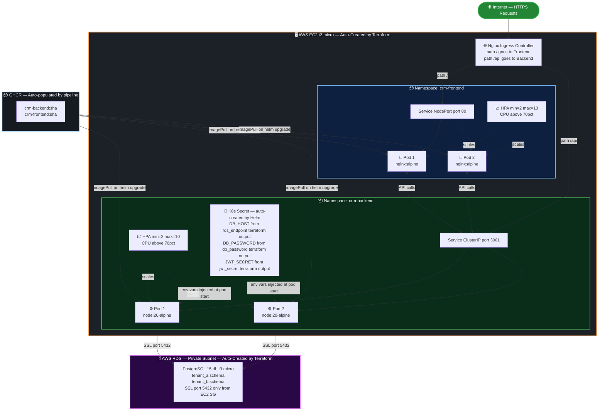
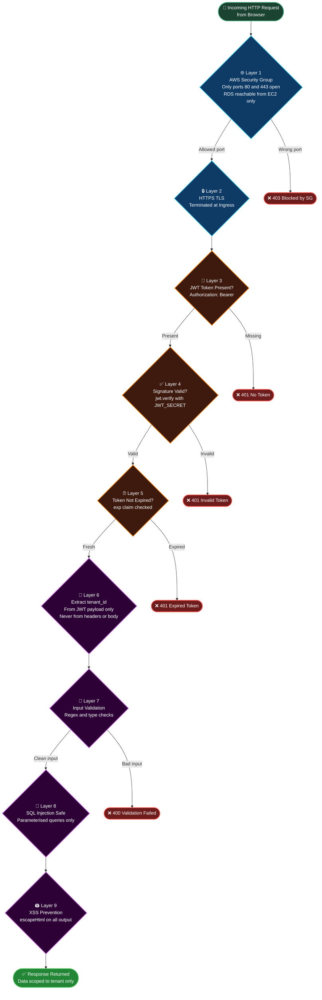

# 🚀 Aura SaaS Platform — System Architecture Flow

> Architecture Version 3.0 | Fully Automated Provisioning — Only 3 GitHub Secrets Needed

---

## 🗺️ 1. Full System Architecture — End to End



---

## 🔄 2. How Secrets Flow Automatically Through the Pipeline



---

## ⚙️ 3. CI/CD Pipeline — 5 Stages Detailed

```mermaid
flowchart TD
    A(["👨‍💻 git push to main"]) --> CI_BLOCK

    subgraph CI_BLOCK ["🧪 Stage 1 — CI Tests (ci-test)"]
        direction LR
        C1["🐍 Python\nflake8 lint\nbcrypt + JWT tests"]
        C2["🟢 Node.js\nnpm audit\nJWT integration test"]
        C3["🖥️ Frontend\nXSS check\nauth overlay check"]
    end

    CI_BLOCK --> BUILD_BLOCK

    subgraph BUILD_BLOCK ["🐳 Stage 2 — Build & Push (build-push)"]
        direction LR
        B1["docker build crm-backend\nDockerfile.backend"]
        B2["docker build crm-frontend\nDockerfile.frontend multi-stage"]
        B3["docker push to GHCR\nboth tagged git SHA + latest"]
        B1 & B2 --> B3
    end

    BUILD_BLOCK --> TF_BLOCK

    subgraph TF_BLOCK ["🏗️ Stage 3 — Provision Infra (provision)"]
        direction TB
        TF_A["Bootstrap S3 state bucket\nidempotent — safe to run every push"]
        TF_B["terraform init\nPull state from S3"]
        TF_C["terraform plan\nShow what will change"]
        TF_D["terraform apply\nCreate or update EC2 + RDS"]
        TF_E["Wait for EC2 bootstrap\nPoll until k3s and Docker are ready"]
        TF_A --> TF_B --> TF_C --> TF_D --> TF_E
    end

    TF_BLOCK --> DBINIT_BLOCK

    subgraph DBINIT_BLOCK ["🗄️ Stage 4 — DB Initialization (db-init)"]
        direction TB
        D1["Open SSH tunnel\nlocalhost:5433 to RDS via EC2"]
        D2["psql run db_init.sql\nCreate tenant schemas"]
        D3["Schema tenant_a\ntables + seed admin"]
        D4["Schema tenant_b\ntables + seed admin"]
        D1 --> D2 --> D3 & D4
    end

    DBINIT_BLOCK --> DEPLOY_BLOCK

    subgraph DEPLOY_BLOCK ["🚀 Stage 5 — Helm Deploy (helm-deploy)"]
        direction TB
        E1["Write SSH key\nfrom terraform output masked"]
        E2["SCP Helm chart\nto EC2 server"]
        E3["SSH into EC2\nhelm upgrade install aura-saas"]
        E4["Kubernetes rolling update\nZero downtime"]
        E1 --> E2 --> E3 --> E4
    end

    DEPLOY_BLOCK --> MONITOR_BLOCK

    subgraph MONITOR_BLOCK ["👁️ Stage 6 — Post-Deploy Monitor (monitor)"]
        direction TB
        M1["Wait for pods to be ready"]
        M2["cURL EC2 Public IP\nPoll up to 12 times (3 mins)"]
        M3["Require HTTP 200 OK\nPipeline fails if app is down"]
        M1 --> M2 --> M3
    end

    MONITOR_BLOCK --> SUCCESS(["🎉 Pipeline\nSUCCESS\nURL: http://EC2-IP"])

    style A fill:#238636,stroke:#3fb950,color:#fff,stroke-width:2px
    style CI_BLOCK fill:#0d3b66,stroke:#5adfff,color:#fff,stroke-width:2px
    style BUILD_BLOCK fill:#1b4332,stroke:#52b788,color:#fff,stroke-width:2px
    style TF_BLOCK fill:#3d0a3d,stroke:#da77f2,color:#fff,stroke-width:2px
    style DBINIT_BLOCK fill:#2d1a00,stroke:#e3b341,color:#fff,stroke-width:2px
    style DEPLOY_BLOCK fill:#3d1a0d,stroke:#f77f00,color:#fff,stroke-width:2px
    style MONITOR_BLOCK fill:#1c1a3d,stroke:#79c0ff,color:#fff,stroke-width:2px
    style SUCCESS fill:#238636,stroke:#3fb950,color:#fff,stroke-width:2px
```



---

## 🔑 4. JWT Multi-Tenant Request Flow



---

## ☸️ 5. Kubernetes Internal Architecture



---

## 🛡️ 6. Security Layer Architecture



---

## 📊 7. Tech Stack and Auto-Provisioning Summary

| Layer | Technology | Provisioned By |
|:---:|:---:|:---|
| 🖥️ **Frontend** | HTML5 + CSS3 + JS + Nginx | Docker image built by GitHub Actions |
| ⚙️ **Backend** | Node.js 20 + Express.js | Docker image built by GitHub Actions |
| 🗄️ **Database** | PostgreSQL 15 on AWS RDS | **Terraform auto-creates** db.t3.micro |
| ☁️ **Compute** | AWS EC2 t2.micro | **Terraform auto-creates** with k3s + Helm pre-installed |
| 🌐 **Networking** | VPC + Subnets + SGs + IGW | **Terraform auto-creates** full network topology |
| 🔑 **SSH Key** | RSA 4096 key pair | **Terraform auto-generates** via tls_private_key |
| 🔐 **DB Password** | 24-char random string | **Terraform auto-generates** via random_password |
| 🪙 **JWT Secret** | 64-char random hex | **Terraform auto-generates** via random_password |
| 📦 **Containers** | Docker multi-stage builds | GitHub Actions builds and pushes to GHCR |
| ☸️ **Orchestration** | Kubernetes k3s + Helm 3 | Helm chart deployed by GitHub Actions via SSH |
| 🔁 **CI/CD** | GitHub Actions (3 workflows) | Triggered on push to main |
| 📦 **Registry** | GHCR | Free — auto-authenticated via GITHUB_TOKEN |
| 🏗️ **IaC** | Terraform | Run by GitHub Actions using AWS secrets |
| 💾 **TF State** | S3 bucket | **Pipeline auto-creates** on first run |

---

## 📋 8. Requirements and Prerequisites

```
Developer adds to GitHub Secrets:     AWS_ACCESS_KEY_ID
                                      AWS_SECRET_ACCESS_KEY
                                      AWS_REGION

Pipeline auto-creates everything:     EC2 public IP
                                      RDS endpoint + DB password
                                      SSH private key (RSA 4096)
                                      JWT signing secret
                                      VPC + Subnets + Security Groups
                                      K8s namespaces + RBAC + Secrets
```


## GitOps & Branching Strategy

To maintain high code quality and isolated testing environments, this project uses a GitFlow-inspired branching strategy mapped to GitHub Actions CI/CD pipelines:

1. **Development (`dev` branch)**
   - All ephemeral branches (`feature/*`, `bugfix/*`) are merged here.
   - Deploys automatically to the **Dev Environment** (using `dev.tfvars` and `values.dev.yaml`).
2. **Staging (`staging` branch)**
   - Used for pre-production testing and QA.
   - Deploys automatically to the **Staging Environment** (using `staging.tfvars` and `values.staging.yaml`).
3. **Production (`main` branch)**
   - The highly stable production release.
   - Deploys automatically to the **Production Environment** (using `prod.tfvars` and `values.prod.yaml`).

Each environment has isolated Terraform state files, separate Kubernetes namespaces (`crm-dev`, `crm-staging`, `crm-prod`), and environment-specific Horizontal Pod Autoscaler (HPA) configurations to balance performance with AWS Free Tier constraints.
