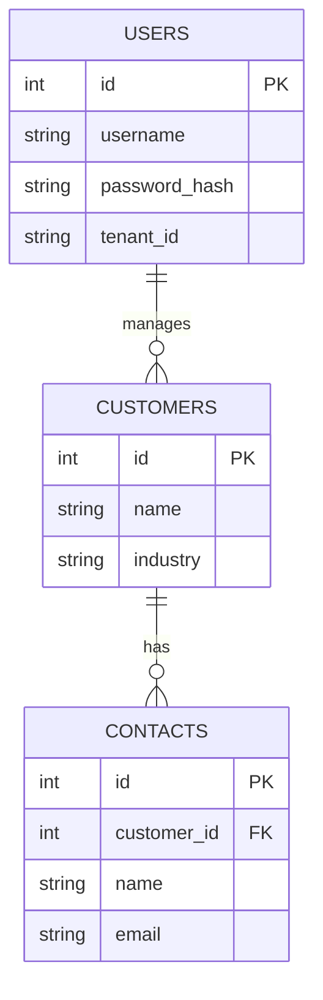

# Low-Level Design (LLD)

## Database Entity Relationship Diagram (Schema-per-Tenant)



# Aura SaaS Platform — Multi-Tenant CRM Platform

**Document Type:** Low-Level Design  
**Project:** Multi-Tenant SaaS CRM with EKS, HPA, and CI/CD Pipeline  
**Author:** Harshit Sharma  
**Version:** 2.0  
**Date:** June 2026

---

## Table of Contents

1. [Frontend Component Design](#1-frontend-component-design)
2. [Backend API Design](#2-backend-api-design)
3. [Database Schema Design](#3-database-schema-design)
4. [JWT Middleware Design](#4-jwt-middleware-design)
5. [Docker Image Specification](#5-docker-image-specification)
6. [Helm Chart Detailed Design](#6-helm-chart-detailed-design)
7. [Kubernetes Manifest Specification](#7-kubernetes-manifest-specification)
8. [GitHub Actions Workflow Specification](#8-github-actions-workflow-specification)
9. [AWS Infrastructure Specification](#9-aws-infrastructure-specification)
10. [Security Implementation Details](#10-security-implementation-details)
11. [File & Directory Structure](#11-file--directory-structure)
12. [Data Flow Diagrams](#12-data-flow-diagrams)

---

## 1. Frontend Component Design

### Technology: Vanilla HTML5 + CSS3 + JavaScript (ES6+)
### Served by: Nginx inside Docker container

### Page Structure

```
index.html
├── <head>
│   ├── Meta tags (SEO, viewport)
│   ├── Google Fonts (Inter)
│   └── Embedded CSS (glassmorphism theme)
│
└── <body>
    ├── #auth-overlay          ← Login screen (shown when no JWT)
    │   ├── #login-form
    │   │   ├── input[type=email]      #email
    │   │   ├── input[type=password]   #password
    │   │   ├── input[type=text]       #tenant-id
    │   │   └── button[type=submit]    #login-btn
    │   └── .error-message             #login-error
    │
    └── #main-app              ← Dashboard (hidden until auth)
        ├── .sidebar           ← Navigation
        ├── .header            ← Top bar with logout button #logout-btn
        └── .content-area
            ├── #customers-panel
            ├── #contacts-panel
            └── #hpa-panel     ← Live pod scaling visualisation
```

### Auth Flow (JavaScript)

```javascript
// On page load
window.onload = function() {
    const token = sessionStorage.getItem('crm_token');
    if (token) {
        showDashboard();
        loadCustomers();  // Fetch with bearer token
    } else {
        showAuthOverlay();
    }
};

// Login handler
async function handleLogin(email, password, tenantId) {
    const resp = await fetch('/api/login', {
        method: 'POST',
        headers: { 'Content-Type': 'application/json' },
        body: JSON.stringify({ email, password, tenant: tenantId })
    });
    if (resp.status === 200) {
        const { token } = await resp.json();
        sessionStorage.setItem('crm_token', token);
        showDashboard();
    } else {
        showError('Invalid credentials');
    }
}

// Authenticated request helper
async function apiCall(path, method='GET', body=null) {
    const token = sessionStorage.getItem('crm_token');
    const opts = {
        method,
        headers: {
            'Content-Type': 'application/json',
            'Authorization': `Bearer ${token}`
        }
    };
    if (body) opts.body = JSON.stringify(body);
    const resp = await fetch(path, opts);
    if (resp.status === 401) {
        // Auto-logout on expired/invalid token
        handleLogout();
        return;
    }
    return resp.json();
}

// XSS Prevention
function escapeHtml(str) {
    return String(str)
        .replace(/&/g, '&amp;')
        .replace(/</g, '&lt;')
        .replace(/>/g, '&gt;')
        .replace(/"/g, '&quot;')
        .replace(/'/g, '&#39;');
}

// Logout
function handleLogout() {
    sessionStorage.removeItem('crm_token');
    showAuthOverlay();
}
```

### Nginx Configuration (inside Docker)

```nginx
# /etc/nginx/conf.d/default.conf
server {
    listen 80;
    server_name _;
    root /usr/share/nginx/html;
    index index.html;

    # Security headers
    add_header X-Frame-Options "SAMEORIGIN";
    add_header X-Content-Type-Options "nosniff";
    add_header X-XSS-Protection "1; mode=block";

    location / {
        try_files $uri $uri/ /index.html;
    }

    # Proxy API calls to backend service
    location /api/ {
        proxy_pass http://crm-backend:3001/;
        proxy_http_version 1.1;
        proxy_set_header Host $host;
        proxy_set_header X-Real-IP $remote_addr;
    }
}
```

---

## 2. Backend API Design

### Technology: Node.js 20 + Express.js
### Port: 3001

### API Endpoints

| Method | Path | Auth | Description |
|---|---|---|---|
| `POST` | `/api/login` | ❌ Public | Authenticate user, return JWT |
| `GET` | `/health` | ❌ Public | Health check (returns 200 OK) |
| `GET` | `/api/customers` | ✅ JWT | List all customers for tenant |
| `POST` | `/api/customers` | ✅ JWT | Create new customer |
| `DELETE` | `/api/customers/:id` | ✅ JWT | Delete customer by ID |
| `GET` | `/api/contacts` | ✅ JWT | List all contacts for tenant |
| `POST` | `/api/contacts` | ✅ JWT | Create new contact |

### Express App Structure

```javascript
// server/index.js — Module breakdown

// 1. Imports
const express = require('express');
const bcrypt  = require('bcryptjs');
const jwt     = require('jsonwebtoken');
const cors    = require('cors');
const { Pool } = require('pg');

// 2. App setup
const app = express();
app.use(express.json({ limit: '10kb' }));   // Payload limit
app.use(cors({ origin: process.env.FRONTEND_URL || '*' }));

// 3. DB Pool (one per app, connects to RDS)
const pool = new Pool({
    host:     process.env.DB_HOST,
    user:     process.env.DB_USER,
    password: process.env.DB_PASSWORD,
    database: process.env.DB_NAME,
    port:     5432,
    ssl:      { rejectUnauthorized: false }  // RDS SSL
});

// 4. JWT Middleware
function requireAuth(req, res, next) {
    const header = req.headers['authorization'];
    if (!header || !header.startsWith('Bearer ')) {
        return res.status(401).json({ error: 'No token provided' });
    }
    try {
        const token = header.split(' ')[1];
        const payload = jwt.verify(token, process.env.JWT_SECRET);
        req.user = payload;            // { sub, tenant_id, exp }
        req.tenantId = payload.tenant_id;
        next();
    } catch (err) {
        return res.status(401).json({ error: 'Invalid or expired token' });
    }
}

// 5. Helper: get tenant-scoped DB client
async function getTenantClient(tenantId) {
    const client = await pool.connect();
    // SET search_path scopes ALL queries to this tenant's schema
    await client.query(`SET search_path TO tenant_${tenantId}, public`);
    return client;
}

// 6. Routes
// POST /api/login
app.post('/api/login', async (req, res) => {
    const { email, password, tenant } = req.body;
    // Input validation
    if (!email || !password || !tenant) {
        return res.status(400).json({ error: 'Missing fields' });
    }
    if (!/^[a-zA-Z0-9_]+$/.test(tenant)) {
        return res.status(400).json({ error: 'Invalid tenant ID' });
    }
    const client = await getTenantClient(tenant);
    try {
        const result = await client.query(
            'SELECT * FROM users WHERE email = $1', [email]
        );
        if (!result.rows.length) {
            return res.status(401).json({ error: 'Invalid credentials' });
        }
        const user = result.rows[0];
        const valid = await bcrypt.compare(password, user.password_hash);
        if (!valid) {
            return res.status(401).json({ error: 'Invalid credentials' });
        }
        const token = jwt.sign(
            { sub: email, tenant_id: tenant },
            process.env.JWT_SECRET,
            { expiresIn: '8h', algorithm: 'HS256' }
        );
        res.json({ token });
    } finally {
        client.release();
    }
});

// GET /api/customers
app.get('/api/customers', requireAuth, async (req, res) => {
    const client = await getTenantClient(req.tenantId);
    try {
        const { rows } = await client.query(
            'SELECT id, name, email, phone FROM customers ORDER BY created_at DESC'
        );
        res.json(rows);
    } finally {
        client.release();
    }
});
```

### Error Handling Pattern

```javascript
// Centralised error handler
app.use((err, req, res, next) => {
    console.error(err.stack);
    res.status(500).json({ error: 'Internal server error' });
});

// Graceful shutdown
process.on('SIGTERM', async () => {
    await pool.end();
    process.exit(0);
});
```

---

## 3. Database Schema Design

### PostgreSQL on AWS RDS

```sql
-- Run once per tenant (replace 'a' with tenant identifier)
CREATE SCHEMA IF NOT EXISTS tenant_a;

SET search_path TO tenant_a;

-- Users table
CREATE TABLE IF NOT EXISTS users (
    id              SERIAL PRIMARY KEY,
    email           VARCHAR(255) UNIQUE NOT NULL,
    password_hash   TEXT NOT NULL,
    full_name       VARCHAR(255),
    role            VARCHAR(50) DEFAULT 'user',
    created_at      TIMESTAMP DEFAULT NOW(),
    updated_at      TIMESTAMP DEFAULT NOW()
);

-- Customers table
CREATE TABLE IF NOT EXISTS customers (
    id              SERIAL PRIMARY KEY,
    name            VARCHAR(255) NOT NULL,
    email           VARCHAR(255),
    phone           VARCHAR(20),
    company         VARCHAR(255),
    status          VARCHAR(50) DEFAULT 'active',
    created_at      TIMESTAMP DEFAULT NOW(),
    updated_at      TIMESTAMP DEFAULT NOW()
);

-- Contacts table
CREATE TABLE IF NOT EXISTS contacts (
    id              SERIAL PRIMARY KEY,
    customer_id     INTEGER REFERENCES customers(id) ON DELETE CASCADE,
    name            VARCHAR(255) NOT NULL,
    email           VARCHAR(255),
    phone           VARCHAR(20),
    role            VARCHAR(100),
    created_at      TIMESTAMP DEFAULT NOW()
);

-- Seed: default admin user (password: Admin@123)
-- bcrypt hash generated at setup time
INSERT INTO users (email, password_hash, full_name, role)
VALUES (
    'admin@tenant-a.com',
    '$2a$10$XXXX...bcrypt_hash_here...XXXX',
    'Tenant A Admin',
    'admin'
) ON CONFLICT DO NOTHING;
```

### Entity Relationship Diagram

```
tenant_a.users
    │ id (PK)
    │ email (UNIQUE)
    │ password_hash
    │ full_name
    └ role

tenant_a.customers ──────────────────┐
    │ id (PK)                         │
    │ name                            │
    │ email                           │  1
    │ phone                           │
    │ company                         │
    └ status                          │
                                      │ FK
tenant_a.contacts                     │
    │ id (PK)                         │
    │ customer_id (FK) ───────────────┘
    │ name
    │ email
    └ phone

(Same schema repeated for tenant_b, tenant_c, etc.)
```

### Database Connection Configuration

> **Key Design Decision:** No database values are hardcoded or manually entered. All values are auto-generated by Terraform and passed through the pipeline as job outputs and environment variables.

| Parameter | Value | How it Gets There |
|---|---|---|
| `DB_HOST` | RDS endpoint (e.g. `aura-saas-db.xxxx.us-east-1.rds.amazonaws.com`) | `terraform output -raw rds_endpoint` → Helm `--set db.host=` → K8s Secret |
| `DB_USER` | `crm_app_user` | Defined in `terraform/variables.tf` → `terraform output db_username` → Helm `--set` |
| `DB_PASSWORD` | 24-char random string | `random_password` resource in Terraform → `terraform output -raw db_password` → masked → Helm `--set` |
| `DB_NAME` | `crm_db` | Defined in `terraform/variables.tf` → `terraform output db_name` → Helm `--set` |
| `DB_PORT` | `5432` | Hardcoded (standard PostgreSQL port, never changes) |
| `JWT_SECRET` | 64-char random hex string | `random_password` resource → `terraform output -raw jwt_secret` → masked → Helm `--set` |
| SSL | Enabled | `ssl: { rejectUnauthorized: false }` in Express pg Pool config |

### Auto-Provisioning Pipeline (LLD)

This is the exact sequence of how all values flow from Terraform → GitHub Actions → Kubernetes:

```
STEP 1: Developer pushes to main

STEP 2: GitHub Actions — ci-test & build-push
  Runs linting, security tests
  Builds Docker images and pushes to GHCR

STEP 3: GitHub Actions — provision job
  terraform apply
    └→ Creates: EC2 t2.micro, RDS db.t3.micro, VPC, Security Groups
    └→ Generates: tls_private_key (RSA 4096) → aws_key_pair
    └→ Generates: random_password (24 chars) → RDS password
    └→ Generates: random_password (64 chars) → JWT secret
  
  Waits for EC2 bootstrap to finish

STEP 4: GitHub Actions — db-init job
  Runs: terraform output -raw to get endpoints and keys securely
  Opens SSH tunnel: localhost:5433 → EC2 → RDS:5432
  Runs: psql -f scripts/db_init.sql
  Creates: tenant_a schema, tenant_b schema, tables, seed users

STEP 5: GitHub Actions — helm-deploy job
  Runs: terraform output -raw to get endpoints and keys securely
  SSH into EC2 (using ssh_private_key output)
  Runs helm upgrade --install aura-saas ./helm/aura-saas \
    --set db.host=<rds_endpoint>         ← from terraform output
    --set db.password=<db_password>      ← from terraform output (masked)
    --set db.username=<db_username>      ← from terraform output
    --set db.name=<db_name>              ← from terraform output
    --set jwtSecret=<jwt_secret>         ← from terraform output (masked)
    --set backend.image.tag=<git-sha>    ← from GITHUB_SHA env var
  
  Helm renders K8s Secrets with these values
  Kubernetes injects them as env vars into backend pods
  Backend pods connect to RDS using these env vars

STEP 6: GitHub Actions — monitor job
  Sleeps for a few seconds to let pods start
  Polls the EC2 Public IP up to 12 times
  Fails pipeline if it does not receive HTTP 200 OK
```

---

## 4. JWT Middleware Design

### Token Structure

```
Header:    { alg: "HS256", typ: "JWT" }
Payload:   { sub: "user@email.com", tenant_id: "a", iat: 1234567890, exp: 1234596690 }
Signature: HMACSHA256(base64(header)+"."+base64(payload), JWT_SECRET)
```

### Validation Checks (in order)

1. **Header presence** — `Authorization: Bearer <token>` must exist
2. **Token format** — must be 3-part dot-separated string
3. **Signature verification** — HMAC-SHA256 with `JWT_SECRET`
4. **Expiry check** — `exp` must be in the future
5. **Tenant ID extraction** — `payload.tenant_id` must be alphanumeric

### Token Lifecycle

```
User Login
    → Token issued with 8h expiry
    → Stored in sessionStorage (NOT localStorage)
    → Sent as Authorization: Bearer header on every API call
    → Backend verifies every request
    → 401 response → frontend auto-clears token & shows login
    → User must re-authenticate after 8 hours
```

---

## 5. Docker Image Specification

### Backend Image (`backend/Dockerfile`)

```dockerfile
FROM node:20-alpine AS builder
WORKDIR /usr/src/app

COPY backend/package*.json ./
RUN npm ci --only=production

COPY backend/index.js ./

FROM node:20-alpine
ENV NODE_ENV=production
RUN addgroup -S aura && adduser -S aura -G aura
WORKDIR /home/aura/app

COPY --from=builder --chown=aura:aura /usr/src/app ./
USER aura
EXPOSE 3001
CMD ["node", "index.js"]
```

### Frontend Image (`frontend/Dockerfile`)

```dockerfile
# Stage 1: Build static frontend assets
FROM node:20-alpine AS builder
WORKDIR /app

COPY package*.json vite.config.js ./
RUN npm ci

COPY frontend/ ./frontend/
RUN npm run build

# Stage 2: Serve with Nginx
FROM nginx:alpine
RUN rm -rf /usr/share/nginx/html/*
COPY --from=builder /app/dist /usr/share/nginx/html

RUN echo "server { \
    listen 80; \
    server_name localhost; \
    root /usr/share/nginx/html; \
    index index.html; \
    location / { \
        try_files \$uri \$uri/ /index.html; \
    } \
    add_header X-Frame-Options 'SAMEORIGIN'; \
    add_header X-XSS-Protection '1; mode=block'; \
    add_header X-Content-Type-Options 'nosniff'; \
}" > /etc/nginx/conf.d/default.conf

EXPOSE 80
CMD ["nginx", "-g", "daemon off;"]
```

### Image Tags Strategy

| Tag | When | Purpose |
|---|---|---|
| `:latest` | Every push to `main` | Easy reference for "current prod" |
| `:<git-sha>` | Every build | Exact version tracking, rollback |
| `:<semver>` | Tagged releases | Semantic versioning (v1.0.0) |

---

## 6. Helm Chart Detailed Design

### Chart Structure

```
helm/aura-saas/
├── Chart.yaml
├── values.yaml           ← Default values
├── values.prod.yaml      ← Production overrides
└── templates/
    ├── _helpers.tpl      ← Common template functions
    ├── namespace.yaml
    ├── secret.yaml       ← DB creds + JWT secret
    ├── configmap.yaml    ← Non-sensitive config
    ├── backend/
    │   ├── deployment.yaml
    │   ├── service.yaml
    │   └── hpa.yaml
    ├── frontend/
    │   ├── deployment.yaml
    │   ├── service.yaml
    │   └── hpa.yaml
    ├── ingress.yaml
    └── rbac.yaml
```

### values.yaml (Default)

```yaml
# helm/aura-saas/values.yaml
global:
  imageRegistry: ghcr.io
  repository: username/aura-saas

backend:
  image:
    name: crm-backend
    tag: latest         # Overridden by CI with git SHA
    pullPolicy: Always
  replicas:
    min: 2
    max: 10
  resources:
    requests:
      cpu: 100m
      memory: 128Mi
    limits:
      cpu: 500m
      memory: 512Mi
  port: 3001

frontend:
  image:
    name: crm-frontend
    tag: latest
    pullPolicy: Always
  replicas:
    min: 2
    max: 10
  resources:
    requests:
      cpu: 50m
      memory: 64Mi
    limits:
      cpu: 200m
      memory: 256Mi
  port: 80

hpa:
  cpuTargetUtilization: 70

ingress:
  enabled: true
  className: nginx
  host: ""   # Set via --set in CI/CD

db:
  name: crm_db
  port: 5432
  # host, user, password injected from GitHub Secrets via --set
```

### Helm Deploy Command (used in deploy.yml)

```bash
helm upgrade --install aura-saas ./helm/aura-saas \
  --namespace crm \
  --create-namespace \
  --set backend.image.tag=${GITHUB_SHA::7} \
  --set frontend.image.tag=${GITHUB_SHA::7} \
  --set db.host=${{ secrets.DB_HOST }} \
  --set db.user=${{ secrets.DB_USER }} \
  --set db.password=${{ secrets.DB_PASSWORD }} \
  --set db.name=${{ secrets.DB_NAME }} \
  --set jwtSecret=${{ secrets.JWT_SECRET }} \
  --set ingress.host=${{ vars.APP_URL }} \
  --wait \
  --timeout 5m
```

---

## 7. Kubernetes Manifest Specification

### Backend Deployment (Helm Template)

```yaml
apiVersion: apps/v1
kind: Deployment
metadata:
  name: crm-backend
  namespace: crm
spec:
  replicas: {{ .Values.backend.replicas.min }}
  selector:
    matchLabels:
      app: crm-backend
  strategy:
    type: RollingUpdate
    rollingUpdate:
      maxSurge: 1
      maxUnavailable: 0   # Zero-downtime deploy
  template:
    metadata:
      labels:
        app: crm-backend
        version: {{ .Values.backend.image.tag }}
    spec:
      serviceAccountName: crm-backend-sa
      securityContext:
        runAsNonRoot: true
        runAsUser: 1001
      containers:
        - name: backend
          image: "{{ .Values.global.imageRegistry }}/{{ .Values.global.repository }}/{{ .Values.backend.image.name }}:{{ .Values.backend.image.tag }}"
          imagePullPolicy: {{ .Values.backend.image.pullPolicy }}
          ports:
            - containerPort: 3001
          env:
            - name: DB_HOST
              valueFrom:
                secretKeyRef:
                  name: crm-db-secret
                  key: host
            - name: DB_USER
              valueFrom:
                secretKeyRef:
                  name: crm-db-secret
                  key: user
            - name: DB_PASSWORD
              valueFrom:
                secretKeyRef:
                  name: crm-db-secret
                  key: password
            - name: DB_NAME
              valueFrom:
                configMapKeyRef:
                  name: crm-config
                  key: db_name
            - name: JWT_SECRET
              valueFrom:
                secretKeyRef:
                  name: crm-jwt-secret
                  key: jwt_secret
          resources:
            requests:
              cpu: {{ .Values.backend.resources.requests.cpu }}
              memory: {{ .Values.backend.resources.requests.memory }}
            limits:
              cpu: {{ .Values.backend.resources.limits.cpu }}
              memory: {{ .Values.backend.resources.limits.memory }}
          livenessProbe:
            httpGet:
              path: /health
              port: 3001
            initialDelaySeconds: 10
            periodSeconds: 30
          readinessProbe:
            httpGet:
              path: /health
              port: 3001
            initialDelaySeconds: 5
            periodSeconds: 10
```

### Ingress Resource

```yaml
apiVersion: networking.k8s.io/v1
kind: Ingress
metadata:
  name: crm-ingress
  namespace: crm
  annotations:
    nginx.ingress.kubernetes.io/rewrite-target: /
    nginx.ingress.kubernetes.io/ssl-redirect: "true"
spec:
  ingressClassName: nginx
  rules:
    - host: {{ .Values.ingress.host }}
      http:
        paths:
          - path: /api
            pathType: Prefix
            backend:
              service:
                name: crm-backend
                port:
                  number: 3001
          - path: /
            pathType: Prefix
            backend:
              service:
                name: crm-frontend
                port:
                  number: 80
```

### HPA Specification

```yaml
apiVersion: autoscaling/v2
kind: HorizontalPodAutoscaler
metadata:
  name: crm-backend-hpa
  namespace: crm
spec:
  scaleTargetRef:
    apiVersion: apps/v1
    kind: Deployment
    name: crm-backend
  minReplicas: {{ .Values.backend.replicas.min }}    # 2
  maxReplicas: {{ .Values.backend.replicas.max }}    # 10
  metrics:
    - type: Resource
      resource:
        name: cpu
        target:
          type: Utilization
          averageUtilization: {{ .Values.hpa.cpuTargetUtilization }}  # 70
  behavior:
    scaleDown:
      stabilizationWindowSeconds: 300  # 5 min cooldown before scale-down
```

### RBAC

```yaml
apiVersion: v1
kind: ServiceAccount
metadata:
  name: crm-backend-sa
  namespace: crm
---
apiVersion: rbac.authorization.k8s.io/v1
kind: Role
metadata:
  name: crm-backend-role
  namespace: crm
rules:
  - apiGroups: [""]
    resources: ["configmaps", "secrets"]
    verbs: ["get"]   # Read-only, cannot modify cluster resources
---
apiVersion: rbac.authorization.k8s.io/v1
kind: RoleBinding
metadata:
  name: crm-backend-rolebinding
  namespace: crm
subjects:
  - kind: ServiceAccount
    name: crm-backend-sa
roleRef:
  kind: Role
  name: crm-backend-role
  apiGroup: rbac.authorization.k8s.io
```

---

## 8. GitHub Actions Workflow Specification

### Trigger Logic

```yaml
# deploy.yml trigger (to activate on push to main)
on:
  push:
    branches: [main]
  workflow_run:
    workflows: ["CI — Lint & Test"]
    types: [completed]
    branches: [main]
```

### Job Dependencies

```
ci.yml (on push/PR):
  python-ci      ─┐
  node-ci        ─┤── Independent, run in parallel
  frontend-check ─┘

deploy.yml (on push to main, after CI):
  check-ci → docker-build-push → deploy
                │
                ├── Build backend image
                ├── Build frontend image
                ├── Push both to GHCR
                └── SSH → helm upgrade → smoke test
```

### Secret Injection Pattern

```yaml
# How secrets flow from GitHub → K8s
steps:
  - name: Deploy with Helm
    run: |
      ssh -i ~/.ssh/deploy_key ${{ secrets.DEPLOY_USER }}@${{ secrets.DEPLOY_HOST }} \
        "helm upgrade --install aura-saas ./helm/aura-saas \
          --set db.password=${{ secrets.DB_PASSWORD }} \
          --set jwtSecret=${{ secrets.JWT_SECRET }}"
```

> **Note:** Secrets are passed as Helm `--set` values which become Kubernetes Secrets inside the cluster. They are NEVER written to files, logs, or source code.

---

## 9. AWS Infrastructure Specification

### EC2 Setup (Manual/Terraform)

```bash
# EC2 User Data script (runs on first boot)
#!/bin/bash
apt-get update -y
apt-get install -y docker.io curl

# Install k3s (lightweight Kubernetes)
curl -sfL https://get.k3s.io | sh -

# Install Helm
curl https://raw.githubusercontent.com/helm/helm/main/scripts/get-helm-3 | bash

# Configure KUBECONFIG for deploy user
mkdir -p /home/ubuntu/.kube
cp /etc/rancher/k3s/k3s.yaml /home/ubuntu/.kube/config
chown ubuntu:ubuntu /home/ubuntu/.kube/config
```

### Terraform Resources

```hcl
# terraform/main.tf
terraform {
  required_providers {
    aws = {
      source  = "hashicorp/aws"
      version = "~> 5.0"
    }
  }
}

provider "aws" {
  region = var.aws_region
}

# EC2 Security Group
resource "aws_security_group" "crm_ec2_sg" {
  name = "crm-ec2-sg"

  ingress {
    from_port   = 22
    to_port     = 22
    protocol    = "tcp"
    cidr_blocks = ["0.0.0.0/0"]  # Restrict to GitHub Actions IPs in production
  }

  ingress {
    from_port   = 80
    to_port     = 80
    protocol    = "tcp"
    cidr_blocks = ["0.0.0.0/0"]
  }

  egress {
    from_port   = 0
    to_port     = 0
    protocol    = "-1"
    cidr_blocks = ["0.0.0.0/0"]
  }
}

# RDS Security Group
resource "aws_security_group" "crm_rds_sg" {
  name = "crm-rds-sg"

  ingress {
    from_port       = 5432
    to_port         = 5432
    protocol        = "tcp"
    security_groups = [aws_security_group.crm_ec2_sg.id]  # EC2 only
  }
}

# EC2 Instance
resource "aws_instance" "crm_server" {
  ami                    = "ami-0c02fb55956c7d316"  # Ubuntu 22.04
  instance_type          = "t2.micro"               # Free tier
  key_name               = var.key_pair_name
  vpc_security_group_ids = [aws_security_group.crm_ec2_sg.id]
  user_data              = file("scripts/ec2_setup.sh")

  tags = { Name = "aura-saas-server" }
}

# RDS Instance
resource "aws_db_instance" "crm_postgres" {
  identifier           = "aura-saas-db"
  engine               = "postgres"
  engine_version       = "15"
  instance_class       = "db.t3.micro"  # Free tier
  allocated_storage    = 20
  db_name              = "crm_db"
  username             = var.db_username
  password             = var.db_password
  publicly_accessible  = false
  skip_final_snapshot  = true
  vpc_security_group_ids = [aws_security_group.crm_rds_sg.id]

  tags = { Name = "aura-saas-rds" }
}
```

---

## 10. Security Implementation Details

### Input Validation (Backend)

```javascript
// Whitelist-based validation
const TENANT_REGEX = /^[a-zA-Z0-9_]{1,50}$/;
const EMAIL_REGEX  = /^[^\s@]+@[^\s@]+\.[^\s@]+$/;
const NAME_REGEX   = /^[a-zA-Z\s\-'.]{1,100}$/;
const PHONE_REGEX  = /^[\+0-9\s\-\(\)]{0,20}$/;

function validateCustomerInput(body) {
    if (!body.name || !NAME_REGEX.test(body.name)) {
        throw new Error('Invalid customer name');
    }
    if (body.email && !EMAIL_REGEX.test(body.email)) {
        throw new Error('Invalid email format');
    }
    if (body.phone && !PHONE_REGEX.test(body.phone)) {
        throw new Error('Invalid phone number');
    }
}
```

### SQL Injection Prevention

```javascript
// ALWAYS use parameterised queries — NEVER string concatenation
// ✅ Safe
const result = await client.query(
    'SELECT * FROM customers WHERE email = $1 AND id = $2',
    [email, id]
);

// ❌ NEVER do this
const result = await client.query(
    `SELECT * FROM customers WHERE email = '${email}'`  // SQL injection risk!
);
```

### CORS Configuration

```javascript
// Express CORS — explicit allowlist
app.use(cors({
    origin: function(origin, callback) {
        const allowed = [
            process.env.FRONTEND_URL,
            'http://localhost:3000'  // Local dev only
        ];
        if (!origin || allowed.includes(origin)) {
            callback(null, true);
        } else {
            callback(new Error('CORS policy violation'));
        }
    },
    credentials: true,
    methods: ['GET', 'POST', 'DELETE'],
    allowedHeaders: ['Content-Type', 'Authorization']
}));
```

---

## 11. File & Directory Structure

```
aura-saas/ (Project Root)
│
├── .github/
│   └── workflows/
│       └── pipeline.yml    # CI/CD: Linters, tests, builds, K8s deploys & rollback checks
│
├── backend/                # Express backend service
│   ├── index.js            # Node Express server
│   ├── Dockerfile          # Node production runner
│   ├── package.json
│   └── package-lock.json
│
├── frontend/               # Single Page Application
│   ├── css/
│   │   └── style.css       # Extracted layout style sheet
│   ├── js/
│   │   └── app.js          # Extracted client-side JS app
│   ├── index.html          # Clean HTML referencing assets
│   └── Dockerfile          # Multi-stage container builder using Vite
│
├── helm/
│   └── aura-saas/           # Helm chart for Kubernetes deployment
│       ├── Chart.yaml
│       ├── values.yaml
│       ├── values.dev.yaml
│       ├── values.staging.yaml
│       ├── values.prod.yaml
│       └── templates/
│           ├── backend-deployment.yaml
│           ├── frontend-deployment.yaml
│           ├── hpa.yaml
│           ├── ingress.yaml
│           ├── postgres-deployment.yaml
│           ├── rbac.yaml
│           └── service.yaml
│
├── infra/
│   └── terraform/           # Infrastructure as Code (AWS VPC, EC2, RDS)
│       ├── environments/
│       │   ├── dev.tfvars
│       │   ├── prod.tfvars
│       │   └── staging.tfvars
│       ├── scripts/
│       │   └── ec2_bootstrap.sh
│       ├── main.tf
│       ├── outputs.tf
│       └── variables.tf
│
├── tests/                  # Automation testing suites
│   └── backend/
│       └── helpers.test.js # Node.js backend helper unit tests
│
├── legacy/                 # Reference Blueprints for Capstone
│   ├── assignment.py       # Legacy mock python-flask reference
│   └── Jenkinsfile         # Jenkins multicloud pipeline reference
│
├── vite.config.js          # Root Vite builder configuration
├── package.json            # Main workspace entry points
├── .gitignore
├── .dockerignore
└── README.md               # Main repository documentation
```

---

## 12. Data Flow Diagrams

### Customer Creation Flow

```
User (Browser)
    │
    │  POST /api/customers
    │  Body: { name, email, phone }
    │  Header: Authorization: Bearer <jwt>
    ▼
Ingress Controller (Nginx)
    │  Routes /api/* → crm-backend Service
    ▼
crm-backend Service (ClusterIP)
    │  Load balances to one of 2-10 backend pods
    ▼
Express Backend Pod
    ├─ 1. requireAuth middleware
    │      ├─ Extract token from Authorization header
    │      ├─ jwt.verify(token, JWT_SECRET)
    │      ├─ Extract tenant_id = payload.tenant_id
    │      └─ req.tenantId = 'a'
    │
    ├─ 2. Input validation
    │      ├─ Validate name (regex)
    │      ├─ Validate email (regex)
    │      └─ Validate phone (regex)
    │
    ├─ 3. Get tenant DB client
    │      ├─ pool.connect()
    │      └─ SET search_path TO tenant_a, public
    │
    ├─ 4. INSERT INTO customers (name, email, phone) VALUES ($1, $2, $3)
    │
    └─ 5. Return 201 Created { id, name, email, phone }
    ▼
AWS RDS PostgreSQL
    │  Executes: INSERT INTO tenant_a.customers ...
    └─ Returns new row ID
```

---

*End of LLD Document*


## GitOps & Branching Strategy

To maintain high code quality and isolated testing environments, this project uses a GitFlow-inspired branching strategy mapped to GitHub Actions CI/CD pipelines:

1. **Development (`dev` branch)**
   - All ephemeral branches (`feature/*`, `bugfix/*`) are merged here.
   - Deploys automatically to the **Dev Environment** (using `dev.tfvars` and `values.dev.yaml`).
2. **Staging (`staging` branch)**
   - Used for pre-production testing and QA.
   - Deploys automatically to the **Staging Environment** (using `staging.tfvars` and `values.staging.yaml`).
3. **Production (`main` branch)**
   - The highly stable production release.
   - Deploys automatically to the **Production Environment** (using `prod.tfvars` and `values.prod.yaml`).

Each environment has isolated Terraform state files, separate Kubernetes namespaces (`crm-dev`, `crm-staging`, `crm-prod`), and environment-specific Horizontal Pod Autoscaler (HPA) configurations to balance performance with AWS Free Tier constraints.
