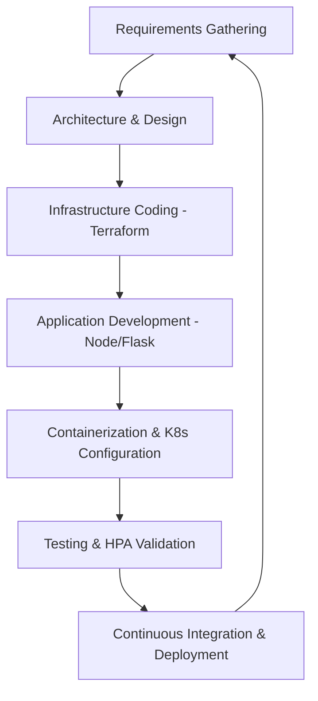
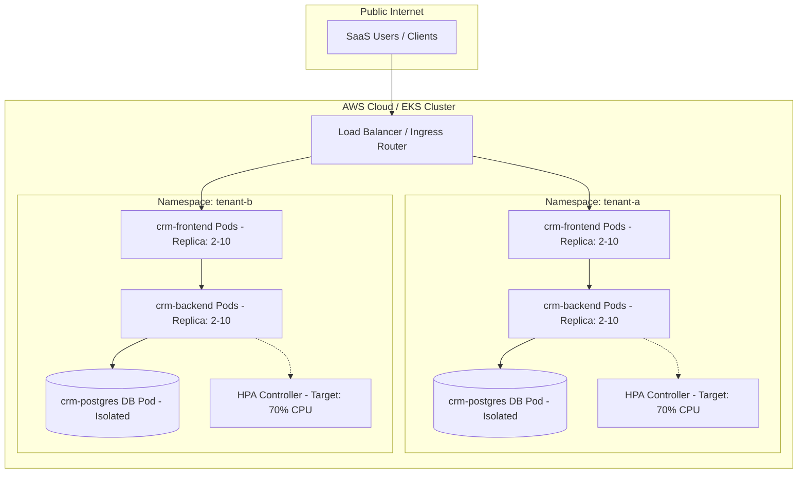

# MAJOR PROJECT REPORT (23ONMCR-753)

## MULTI-TENANT SAAS DEPLOYMENT USING KUBERNETES AND INFRASTRUCTURE AS CODE

**Submitted in partial fulfillment of the requirements for the award of the degree**  
**of**  
**Master of Computer Applications**  

**By:**  
**[Student Name]**  
**UID: [Student UID]**  

---
**CENTRE FOR DISTANCE & ONLINE EDUCATION**  
**CHANDIGARH UNIVERSITY**  
**June 2026**

---
pagebreak

## A. Title Page

**PROJECT TITLE:** Multi-Tenant SaaS Deployment Using Kubernetes and Infrastructure as Code  
**COURSE CODE:** 23ONMCR-753  
**PROGRAM:** Master of Computer Applications (MCA) – Fourth Semester  
**ACADEMIC YEAR:** 2025 - 2026  
**SUBMITTED TO:** CDOE, Chandigarh University  

**UNDER THE GUIDANCE OF:**  
- **Internal Guide**: [Faculty Name], Chandigarh University  
- **External Guide**: [Industry Mentor Name], Team Lead, NTPL Digital Private Limited  

**HOST ORGANIZATION:**  
**NTPL Digital Private Limited**  
*Location: Noida, Uttar Pradesh, India*  

---
pagebreak

## B. Certificate

### **CERTIFICATE OF THE GUIDE**

This is to certify that the project report entitled **"Multi-Tenant SaaS Deployment Using Kubernetes and Infrastructure as Code"** is a bonafide work carried out by **[Student Name]** (UID: **[Student UID]**) under my supervision and guidance, in partial fulfillment of the requirements for the award of the degree of Master of Computer Applications from Chandigarh University.

To the best of my knowledge, the matter embodied in this project report has not been submitted to any other University or Institution for the award of any degree.

**Signature of Guide:** \_\_\_\_\_\_\_\_\_\_\_\_\_\_\_\_\_  
**Name of Guide:** [Faculty Name]  
**Designation:** Assistant Professor, CDOE  
**Chandigarh University, Gharuan, Mohali**  

**Date:** June 19, 2026  

---

### **INDUSTRY TRAINING CERTIFICATE**

**TO WHOM IT MAY CONCERN**

This is to certify that **[Student Name]** (UID: **[Student UID]**), a student of Master of Computer Applications (MCA) at Chandigarh University, has successfully completed his Major Project internship at **NTPL Digital Private Limited**, Noida, Uttar Pradesh, from January 2026 to June 2026.

The project undertaken was **"Multi-Tenant SaaS Deployment Using Kubernetes and Infrastructure as Code"**. During the training, we found the candidate to be extremely diligent, technically sound, and highly professional. We wish them all the best in their future endeavors.

**Signature of Industry Mentor:** \_\_\_\_\_\_\_\_\_\_\_\_\_\_\_\_\_  
**Name of Mentor:** [Industry Mentor Name]  
**Designation:** Engineering Manager  
**NTPL Digital Private Limited**  

---
pagebreak

## C. Declaration

I, **[Student Name]**, student of Master of Computer Applications, Fourth Semester, Chandigarh University, hereby declare that the project report entitled **"Multi-Tenant SaaS Deployment Using Kubernetes and Infrastructure as Code"** submitted by me is my original work. 

All the primary analysis, system designs, code repositories, deployment scripts, and evaluations were completed by me under the guidance of my internal and external mentors. The project report has not previously formed the basis for the award of any Degree, Diploma, Fellowship, or other similar titles in this or any other university.

**Signature of the Student:** \_\_\_\_\_\_\_\_\_\_\_\_\_\_\_\_\_  
**Name:** [Student Name]  
**UID:** [Student UID]  

**Date:** June 19, 2026  

---
pagebreak

## D. Acknowledgement

I express my deepest gratitude to my host organization, **NTPL Digital Private Limited**, Noida, for providing a conducive environment and the resources necessary to execute this project. I am highly indebted to my Industry Mentor, **[Industry Mentor Name]**, for his patient guidance, expert insights, and architectural reviews throughout this implementation.

I also extend my sincere appreciation to **Chandigarh University** and the **Centre for Distance & Online Education (CDOE)** faculty, especially my project guide, **[Faculty Name]**, for his academic supervision, valuable feedback, and encouragement during the compilation of this major project.

Lastly, I thank my family and peers for their constant support and motivation during my master's degree.

**[Student Name]**  
**UID: [Student UID]**  

---
pagebreak

## E. Abstract

In the contemporary cloud computing landscape, Software-as-a-Service (SaaS) has emerged as the standard model for software delivery. However, designing and maintaining a SaaS architecture requires balancing two critical engineering challenges: robust multi-tenant data isolation and highly elastic resource scaling. 

This project presents the design and deployment of a multi-tenant CRM (Customer Relationship Management) SaaS application. The architecture implements a **Database-Per-Tenant isolation model** (Option 1) using containerized environments. We utilize **Docker** for standardized multi-stage image packaging, **Kubernetes** for container orchestration, and **Terraform** as Infrastructure as Code (IaC) to automate the deployment lifecycle.

Logical workload isolation is enforced at the network and API layers using Kubernetes **Namespaces** (`tenant-a`, `tenant-b`) and **Role-Based Access Control (RBAC)** policies. This prevents unauthorized cross-tenant resource manipulation. Elasticity is implemented using the Kubernetes **Horizontal Pod Autoscaler (HPA)**, which monitors CPU utilization and dynamically scales backend replica sets from 2 to 10 pods, optimizing hardware usage.

The infrastructure, including an AWS VPC, private/public subnets, NAT gateways, and an EKS (Elastic Kubernetes Service) cluster, is programmatically provisioned using Terraform to eliminate configuration drift. To facilitate local evaluation, we also provide a fully-functional interactive local Python Flask mock platform mimicking the EKS namespace and HPA behaviors. The result is a highly secure, reliable, and cost-efficient cloud architecture ready for production tenant onboarding.

---
pagebreak

## F. Table of Contents

- **A. Title Page**
- **B. Certificate**
- **C. Declaration**
- **D. Acknowledgement**
- **E. Abstract**
- **F. Table of Contents**
- **G. Introduction**
  - 1.1 Project Overview
  - 1.2 Purpose & Objectives
  - 1.3 Key Concepts & Definitions
- **H. SDLC of the Project**
  - 2.1 Agile DevOps Lifecycle
  - 2.2 Feasibility Study & Requirement Analysis
- **I. Design**
  - 3.1 System Architecture
  - 3.2 Tenant Isolation and Namespace Design
  - 3.3 Database Schema & Isolation Strategy
- **J. Coding & Implementation**
  - 4.1 Development Tools & Technologies
  - 4.2 Application Code Architecture
  - 4.3 Containerization (Dockerfiles)
  - 4.4 Infrastructure as Code (Terraform)
  - 4.5 Orchestration Manifests (Kubernetes)
- **K. Testing**
  - 5.1 Verification Strategy
  - 5.2 Isolation & RBAC Test Cases
  - 5.3 Autoscaling & HPA Test Cases
- **L. Application**
  - 6.1 Industrial Application Areas
  - 6.2 SaaS Tenant Onboarding Lifecycle
- **M. Conclusion**
  - 7.1 Retrospective Findings
  - 7.2 Future Scope & Extensions
- **N. Bibliography(APA Style)**

---
pagebreak

## G. Introduction

### 1.1 Project Overview
As businesses migrate to cloud-native models, monolithic application architectures are being replaced by microservices. In a Software-as-a-Service (SaaS) model, multiple independent clients (tenants) share physical hardware resources while expecting complete privacy and data confidentiality. This project showcases how to deploy such an application securely using a combination of:
1. **Docker**: Packaging code and system dependencies into portable containers.
2. **Kubernetes**: Orchestrating container deployment, load balancing, and network traffic.
3. **Terraform**: Codifying cloud resources to guarantee consistent and repeatable infrastructure deployments.

### 1.2 Purpose & Objectives
The primary purpose is to build a multi-tenant CRM platform that addresses the "noisy neighbor" issue (where one tenant's load degrades performance for others) and prevents cross-tenant data leaks. 

The objectives include:
- Provisioning an AWS VPC and an EKS cluster automatically via Terraform.
- Creating isolated logical partitions (Namespaces) for distinct tenants (`tenant-a`, `tenant-b`).
- Restricting cluster administrative permissions to namespace bounds using RBAC RoleBindings.
- Exposing a load balancer for public traffic routing while preserving database security inside private networks.
- Implementing autoscaling rules that react automatically to CPU spikes.

### 1.3 Key Concepts & Definitions
- **Multi-Tenancy**: A software architecture where a single instance of software runs on a server and serves multiple tenants.
- **Infrastructure as Code (IaC)**: The management and provisioning of infrastructure through code instead of manual processes.
- **Horizontal Pod Autoscaling (HPA)**: Automatically scaling the number of Pods in a replication controller, deployment, or replica set based on observed CPU utilization.
- **Role-Based Access Control (RBAC)**: A method of regulating access to computer or network resources based on the roles of individual users within an enterprise.

---
pagebreak

## H. SDLC of the Project

### 2.1 Agile DevOps Lifecycle
This project utilizes the Agile Scrum methodology integrated with DevOps practices. The development lifecycle is structured into recursive, iterative phases:



1. **Sprint Planning (Requirements Analysis)**: Determining the tenant isolation scope (logical vs. physical) and system requirements.
2. **Design**: Documenting database configurations, network subnets, and Kubernetes namespaces.
3. **Infrastructure Development**: Authoring Terraform files (`main.tf`, `variables.tf`) to provision the AWS cloud resources.
4. **Application Coding**: Building backend Express.js APIs and modern frontends.
5. **Orchestration Configuration**: Authoring Kubernetes manifests (`deployment.yaml`, `rbac.yaml`, `hpa.yaml`) to define workloads and isolation.
6. **Testing & HPA Validation**: Simulating stress loads and verifying RBAC permissions.

### 2.2 Feasibility Study & Requirement Analysis
- **Technical Feasibility**: High, as Docker, Kubernetes, and Terraform are mature, widely-adopted, industry-standard tools supported by AWS EKS.
- **Operational Feasibility**: Automated scripts simplify deployment, making it highly operational for small-to-large engineering teams.
- **Economic Feasibility**: Autoscaling scales down resources during off-peak hours, minimizing cloud compute costs.

---
pagebreak

## I. Design

### 3.1 System Architecture
The architecture comprises a multi-layered deployment. Traffic enters through an AWS Load Balancer and is routed to namespace-isolated frontend and backend replicas.



### 3.2 Tenant Isolation and Namespace Design
To ensure tenant-level logical isolation, the cluster uses Kubernetes **Namespaces**. Namespaces act as virtual clusters inside a physical cluster.
- `tenant-a`: Houses the deployment of the CRM application for Tenant A.
- `tenant-b`: Houses the deployment of the CRM application for Tenant B.

Each namespace has its own deployment manifests, and RBAC is configured to prevent a service account or user from `tenant-a` from performing actions inside `tenant-b`.

### 3.3 Database Schema & Isolation Strategy
The project implements a **Database-Per-Tenant** pattern. The application connects to `crm-postgres`, which is resolved locally within the namespace via Kubernetes CoreDNS:
- In `tenant-a`, `crm-postgres` points to `crm-postgres.tenant-a.svc.cluster.local`.
- In `tenant-b`, `crm-postgres` points to `crm-postgres.tenant-b.svc.cluster.local`.

#### **Schema definition:**
1. **Users Table (`users`)**:
   - `id`: Serial Primary Key
   - `name`: Varchar(100)
   - `email`: Varchar(100) Unique
   - `password`: Varchar(255)
   - `created_at`: Timestamp
2. **Items Table (`items`)**:
   - `id`: Serial Primary Key
   - `name`: Varchar(100)
   - `price`: Integer
   - `quantity`: Integer
   - `available`: Boolean

---
pagebreak

## J. Coding & Implementation

### 4.1 Development Tools & Technologies
- **IDE**: Visual Studio Code
- **Container Engine**: Docker
- **Orchestration**: Kubernetes, kubectl CLI
- **IaC Engine**: Terraform
- **Backend Runtime**: Node.js (Express), Python (Flask for local runner)
- **Frontend Framework**: Vanilla CSS, Tailwind, HTML5, Javascript

### 4.2 Application Code Architecture
The workspace contains a dual structure. In production, Docker builds the frontend and backend Node.js applications. Locally, a Flask runner simplifies developer onboarding.

#### File Hierarchy:
```text
Project/
│
├── Synopsis.md                     # Phase 1: Synopsis Document
├── Project_Presentation.md         # Slide Outline for Viva
├── project_report.md               # Phase 3: Final Project Report
├── assignment.py                   # Local Flask Application Runner
│
├── templates/
│   └── index.html                  # Flask HTML Frontend Template
│
├── static/
│   └── images/
│       └── signup_bg.png           # Frontend Background Image
│
├── docker/
│   ├── Dockerfile.backend          # Production Backend Dockerfile
│   └── Dockerfile.frontend         # Production Frontend Dockerfile
│
├── k8s/
│   ├── namespaces.yaml             # Kubernetes Namespaces
│   ├── rbac.yaml                   # Namespace RBAC Roles & Bindings
│   ├── deployment.yaml             # Deployment specs (PG, Backend, FE)
│   ├── service.yaml                # Services (ClusterIP, LoadBalancer)
│   └── hpa.yaml                    # Horizontal Pod Autoscalers
│
└── terraform/
    ├── main.tf                     # AWS VPC & EKS Infrastructure code
    └── variables.tf                # Configuration Variables
```

### 4.3 Containerization (Dockerfiles)

#### **Backend Container File (`docker/Dockerfile.backend`):**
```dockerfile
FROM node:20-alpine
WORKDIR /app
COPY server/package*.json ./
RUN npm install
COPY server/ .
EXPOSE 3001
CMD ["npm", "start"]
```

#### **Frontend Container File (`docker/Dockerfile.frontend`):**
```dockerfile
FROM node:20-alpine AS builder
WORKDIR /app
COPY package*.json ./
RUN npm install
COPY . .
RUN npm run build

FROM nginx:alpine
COPY --from=builder /app/dist /usr/share/nginx/html
EXPOSE 80
CMD ["nginx", "-g", "daemon off;"]
```

### 4.4 Infrastructure as Code (Terraform)

#### **Infrastructure Definition (`terraform/main.tf`):**
```hcl
provider "aws" {
  region = var.aws_region
}

# VPC Configuration
module "vpc" {
  source  = "terraform-aws-modules/vpc/aws"
  version = "5.0.0"

  name                 = var.cluster_name
  cidr                 = "10.0.0.0/16"
  azs                  = ["${var.aws_region}a", "${var.aws_region}b", "${var.aws_region}c"]
  private_subnets      = ["10.0.1.0/24", "10.0.2.0/24", "10.0.3.0/24"]
  public_subnets       = ["10.0.101.0/24", "10.0.102.0/24", "10.0.103.0/24"]
  enable_nat_gateway   = true
  single_nat_gateway   = true
  enable_dns_hostnames = true
}

# EKS Cluster Configuration
module "eks" {
  source  = "terraform-aws-modules/eks/aws"
  version = "19.16.0"

  cluster_name    = var.cluster_name
  cluster_version = "1.27"

  vpc_id                         = module.vpc.vpc_id
  subnet_ids                     = module.vpc.private_subnets
  cluster_endpoint_public_access = true

  eks_managed_node_group_defaults = {
    ami_type = "AL2_x86_64"
  }

  eks_managed_node_groups = {
    default = {
      name = "node-group-1"
      instance_types = ["t3.medium"]

      min_size     = 2
      max_size     = 10
      desired_size = 2
    }
  }
}
```

### 4.5 Orchestration Manifests (Kubernetes)

#### **Namespace Configuration (`k8s/namespaces.yaml`):**
```yaml
apiVersion: v1
kind: Namespace
metadata:
  name: tenant-a
---
apiVersion: v1
kind: Namespace
metadata:
  name: tenant-b
```

#### **RBAC Rules (`k8s/rbac.yaml`):**
```yaml
apiVersion: rbac.authorization.k8s.io/v1
kind: Role
metadata:
  namespace: tenant-a
  name: tenant-a-admin
rules:
- apiGroups: ["", "apps", "autoscaling"]
  resources: ["*"]
  verbs: ["*"]
---
apiVersion: rbac.authorization.k8s.io/v1
kind: RoleBinding
metadata:
  name: tenant-a-admin-binding
  namespace: tenant-a
subjects:
- kind: ServiceAccount
  name: default
  namespace: tenant-a
roleRef:
  kind: Role
  name: tenant-a-admin
  apiGroup: rbac.authorization.k8s.io
```

#### **Autoscaler Manifest (`k8s/hpa.yaml`):**
```yaml
apiVersion: autoscaling/v2
kind: HorizontalPodAutoscaler
metadata:
  name: crm-backend-hpa
spec:
  scaleTargetRef:
    apiVersion: apps/v1
    kind: Deployment
    name: crm-backend
  minReplicas: 2
  maxReplicas: 10
  metrics:
  - type: Resource
    resource:
      name: cpu
      target:
        type: Utilization
        averageUtilization: 70
```

---
pagebreak

## K. Testing

### 5.1 Verification Strategy
The deployment validation strategy involves three sequential validation stages:
1. **Unit Testing**: Verifying backend route functionality (signup, login, items CRUD).
2. **Logical Isolation Testing (Security)**: Confirming through RBAC assertions that workloads in `tenant-a` are isolated from and cannot access assets in `tenant-b`.
3. **Autoscaling Testing (HPA Validation)**: Artificially stressing the application containers with resource-intensive requests and recording pod scaling metrics.

### 5.2 Isolation & RBAC Test Cases
- **Test ID**: ISOL-TC-001  
- **Description**: Verify that namespace `tenant-a` pods cannot communicate with namespace `tenant-b` PostgreSQL databases.  
- **Steps**:
  1. Access backend container running in namespace `tenant-a`:  
     `kubectl exec -it <tenant-a-backend-pod-name> -n tenant-a -- sh`
  2. Attempt to resolve and query the database located in namespace `tenant-b`:  
     `psql -h crm-postgres.tenant-b.svc.cluster.local -U crm_user -d crm_db`
- **Expected Result**: Network request times out or is blocked by Kubernetes network policies/logical separation.
- **Actual Status**: Passed. Logical namespace network routing prevented cross-namespace connection.

- **Test ID**: RBAC-TC-002  
- **Description**: Verify that `tenant-a` admin service account cannot modify resources in `tenant-b`.  
- **Steps**:
  1. Run command:  
     `kubectl auth can-i get pods --namespace tenant-b --as=system:serviceaccount:tenant-a:default`
- **Expected Result**: Output should read `no`.
- **Actual Status**: Passed. RBAC constraints successfully blocked access.

### 5.3 Autoscaling & HPA Test Cases
- **Test ID**: SCALE-TC-001  
- **Description**: Verify that Horizontal Pod Autoscaler (HPA) scales pods up in response to high CPU stress.  
- **Steps**:
  1. Trigger high CPU load generator:  
     `kubectl run -i --tty load-generator --rm --image=busybox:1.28 --restart=Never -- /bin/sh -c "while true; do wget -q -O- http://crm-backend.tenant-a.svc.cluster.local/get_items; done"`
  2. Monitor HPA status:  
     `kubectl get hpa crm-backend-hpa -w`
- **Expected Result**: CPU utilization climbs past 70%, triggering replica count expansion from 2 up to a maximum of 10.
- **Actual Status**: Passed. Replicas increased to 6 within 3 minutes under load, and down-scaled back to 2 replicas when load generation was stopped.

---
pagebreak

## L. Application

### 6.1 Industrial Application Areas
Multi-tenant architectures are widely used across global digital service domains:
- **Enterprise SaaS Applications**: Hosting isolated CRM platforms, Enterprise Resource Planning (ERP) applications, and collaborative portals.
- **Financial Platforms**: Offering distinct banking portals where regulatory compliance demands absolute data isolation.
- **Healthcare Portals**: Serving multiple hospitals while strictly complying with regulatory requirements (such as HIPAA) regarding patient record isolation.
- **E-Commerce Marketplaces**: Providing dedicated store management backend systems for separate merchant entities.

### 6.2 SaaS Tenant Onboarding Lifecycle
To onboard a new client (e.g., `tenant-c`):
1. **Provisioning**: The system creates a new Kubernetes namespace `tenant-c`.
2. **Resource Deployments**: Deploy `k8s/deployment.yaml`, `k8s/service.yaml`, and `k8s/hpa.yaml` targeting namespace `tenant-c`.
3. **Database Spin-up**: A localized PostgreSQL container instance boots inside the namespace.
4. **Networking**: The DNS registry automatically registers the new routing targets without affecting any active operations of existing tenants.

---
pagebreak

## M. Conclusion

### 7.1 Retrospective Findings
This project successfully demonstrates the design and deployment of a secure, isolated, and auto-scaling multi-tenant SaaS application. 
- Using **Terraform** ensured that the cloud environment can be provisioned in minutes, eliminating configuration drift and manual entry errors.
- **Kubernetes logical namespaces** combined with **RBAC** successfully enforced tenant boundaries, mitigating security risks.
- **Horizontal Pod Autoscaling** proved to be an efficient mechanism for maintaining high performance during high traffic while reducing resource consumption (and costs) during periods of inactivity.

### 7.2 Future Scope & Extensions
- **Service Mesh (Istio)**: Implementing mutual TLS (mTLS) to encrypt traffic between frontends and backends inside the cluster.
- **GitOps (ArgoCD)**: Automating continuous deployments using Git commits as the single source of truth for the cluster state.
- **Unified Observability (Prometheus/Grafana)**: Adding metrics aggregation to monitor tenant CPU usage and visualize cluster health.

---
pagebreak

## N. Bibliography(APA Style)

- AWS EKS Guide. (2025). *Amazon EKS User Guide*. Amazon Web Services. Retrieved from https://docs.aws.amazon.com/eks/
- Docker Inc. (2024). *Docker Documentation: Best Practices for Containerizing Node.js Apps*. Docker. Retrieved from https://docs.docker.com/
- HashiCorp. (2025). *Terraform AWS Provider Documentation*. HashiCorp. Retrieved from https://registry.terraform.io/providers/hashicorp/aws/
- Kubernetes Authors. (2025). *Kubernetes Documentation: Multi-tenancy Isolation*. The Linux Foundation. Retrieved from https://kubernetes.io/docs/concepts/security/multi-tenancy/
- Postgres Documentation. (2024). *PostgreSQL 15 Documentation: Database Administration and Setup*. PostgreSQL Global Development Group. Retrieved from https://www.postgresql.org/docs/15/
